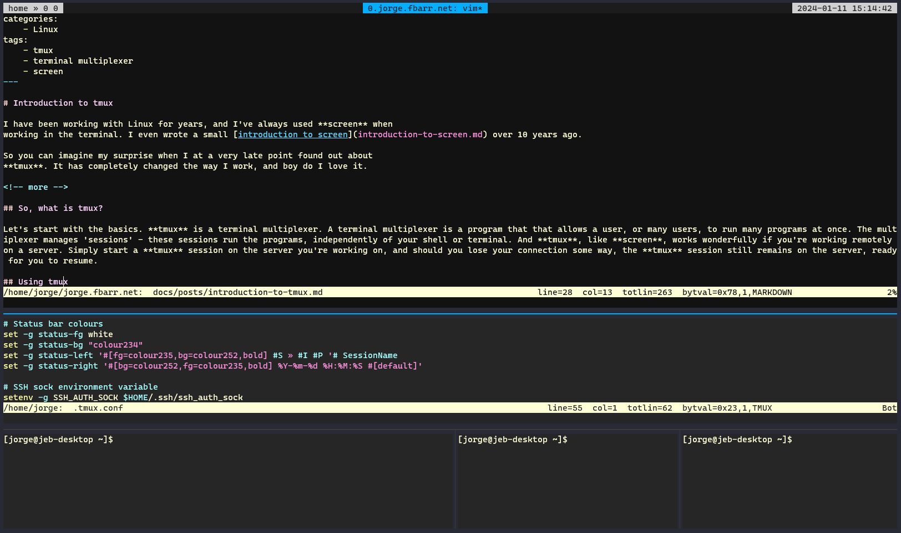

# Introduction to tmux

I have been working with Linux for years, and I've always used **screen** when
working in the terminal. I even wrote a small [introduction to screen](introduction-to-screen.md) over 10 years ago.

So you can imagine my surprise when I at a very late point found out about
**tmux**. It has completely changed the way I work, and boy do I love it.

<!-- more -->

## So, what is tmux?

Let's start with the basics. **tmux** is a terminal multiplexer. A terminal multiplexer is a program that that allows a user, or many users, to run many programs at once. The multiplexer manages 'sessions' - these sessions run the programs, independently of your shell or terminal. And **tmux**, like **screen**, works wonderfully if you're working remotely on a server. Simply start a **tmux** session on the server you're working on, and should you lose your connection some way, the **tmux** session still remains on the server, ready for you to resume.

My current **tmux** looks something like this:



How does this differ from screen? Well, for starters, **tmux** makes it easy to have multiple panes up at the same time, while I found it a bit tedious to do the same with **screen**.

Without going into much further detail, I recommend reading [this post on superuser.com](https://superuser.com/questions/236158/tmux-vs-screen), which lists several differences.

So now you have a bit of information about it, let's get cracking using it.

## Using tmux

Using **tmux** isn't difficult, and it has a lot of other functions that what I
mention here, but this is the main way that **I** use it.


### Installation of tmux

The installation of **tmux** is pretty straight forward:

#### Debian/Ubuntu
```bash
apt-get install tmux
```

#### Fedora
```bash
dnf install tmux
```

Most Linux distributions should have it in their default repo, so it should be
pretty straight forward to install it.


### Starting a session

To start a **tmux** session, simply type:

```bash
tmux
```

or if you want to give the session a name:

```bash
tmux new -s work
```

..which gives your session the name 'work'.

### Handling sessions

#### View
To view **tmux** sessions currently running, type:

```bash
tmux ls
```

..and the output is something like this:

```bash
[jorge@jeb-desktop ~]$ tmux ls
work: 1 windows (created Wed Jan 10 18:19:37 2024) [120x29] (attached)
```

#### Attach

If you're only running a single session of **tmux**, attaching/resuming it only
requires you to type:

```bash
tmux a
```

..or if you'd like to specify the session by name, use:

```bash
tmux a -t work
```

Where 'work' is the name of the session.


#### Detach

To detach a currently running session, while having **tmux** up and running, you
need to press a combination of keys. In this case it's **Ctrl-b d**, which
means pressing **Ctrl-b** first, followed up by the letter **d**. It's often
represented in this way:

```bash
C-b d
```

### Splitting panes

The default way of splitting panes is not intuitive, if you ask me.
Particularly if you're using an ISO layout on your keyboard. However,
the default ways are:

#### Horizontally
```bash
C-b %
```

#### Vertically
```
C-b "
```

#### My way

Luckily, it's possible to modify your config so that you can use a different
key combination. What I'm currently using, and is in my config for **tmux**
(~/.tmux.conf) is:

```bash
bind | split-window -h -c "#{pane_current_path}"
bind - split-window -v -c "#{pane_current_path}"
```

Then the key combination becomes **C-b -** for horizontal splitting and **C-b
|** for vertical splitting. Neat huh?


### Navigating panes

Navigating through panes isn't exacly easy either by default.

```bash
C-b <Arrow key>
```

..meaning that to move up, you have to press **C-b Arrow Up** to move one pane
up, then press **C-b Arrow Right** to go to the pane to the right. If you hold
in **Ctrl**, you can resize the existing pane. This doesn't work at all for me,
particularly if I have to move quickly between the panes. So what I've done is
I've added the following lines to my config:

```bash
bind -n C-M-Left select-pane -L
bind -n C-M-Right select-pane -R
bind -n C-M-Up select-pane -U
bind -n C-M-Down select-pane -D
```

This allows me to use **Ctrl**, **Alt/Meta** and **Arrow Up/Down/Right/Left**
to quickly switch between panes.

#### Zoom

To maximize/minimize your current pane, so that it fills the entire screen,
use:

```bash
C-b z
```

### Closing panes

Closing panes means just killing it. If that's what you want, move your
focus to the pane you want to destroy, and enter the following key combination:

```bash
C-b x
```

Confirm killing the pane with **Y** and **Enter**.

### Configuration

If you want to create your own configuration, then you should place your config in the file **.tmux.conf** in your home directory.

#### My config

That's basically what I need to know to use **tmux**! If you want to take a
look at the configuration I use, see below. Have fun!

```bash
# 0 is the first number
set -g base-index 0

# Automatically set window title
set-window-option -g automatic-rename on
set-option -g set-titles on

# Set scrollback history to 100000 lines
set -g history-limit 100000

# Synchronize panes with 'C-b c'
bind-key c setw synchronize-panes

# Split vertically/horizontally with 'C-b |' and 'C-b -'
bind | split-window -h -c "#{pane_current_path}"
bind - split-window -v -c "#{pane_current_path}"

# Use Ctrl-Alt-Arrow keys without prefix key to switch panes
bind -n C-M-Left select-pane -L
bind -n C-M-Right select-pane -R
bind -n C-M-Up select-pane -U
bind -n C-M-Down select-pane -D

# Smallest delay after you press the escape key. If you put 0, you'll get
# errors like '^[[?61;6;7;22;23;24;'
set -sg escape-time 1

# Reload tmux config with 'C-b r'
bind r source-file ~/.tmux.conf

# Pane border style colour
set -g pane-border-style fg=colour237
set -g pane-active-border-style fg=colour39

# Active/Inactive window colour
set -g window-style 'bg=colour235'
set -g window-active-style 'bg=colour233'

# Default terminal
set -g default-terminal "xterm-256color"
set -ga terminal-overrides ",*256col*:Tc"

# Status bar format and colours
set -g window-status-format '#[bg=colour237,fg=#f8f8f2] #I.#(pwd="#{pane_current_path}"; echo ${pwd####*/}): #W#F '
set -g window-status-current-format '#[bg=colour39,fg=black] #I.#(pwd="#{pane_current_path}"; echo ${pwd####*/}): #W#F '

# Status bar placement
set -g status-justify centre
set -g status-left-length 40
set -g status-right-length 60
set -g status-position top

# Status bar colours
set -g status-fg white
set -g status-bg "colour234"
set -g status-left '#[fg=colour235,bg=colour252,bold] #S » #I #P '# SessionName
set -g status-right '#[bg=colour252,fg=colour235,bold] %Y-%m-%d %H:%M:%S #[default]'

# SSH sock environment variable
setenv -g SSH_AUTH_SOCK $HOME/.ssh/ssh_auth_sock
```

## Possible issues

One of the issues I encountered, when it come to colours, was that I couldn't
exactly match the color I had on one server to another. There were multiple
colours that was not being shown, and that made the terminal look all wonky. I
narrowed it down to that it was the terminal itself that didn't have all the
colours I wanted. When I ran the command **tput**, it showed me only 8 colours:

```bash
[jorge@jeb-desktop ~]$ tput colors
8
```

I need the entire range of 256 colours to make the theme I'm currently using
work properly. So I added this to my **.bashrc** file:

```bash
export TERM=xterm-256color
```

When I then logged completely out of the terminal, and back in, **tput** showed
me 256 colours:

```bash
[jorge@jeb-desktop ~]$ tput colors
256
```

You can also force **tmux** to use 256 colours, even if the terminal only says
8, by adding a **-2** in the command:

```bash
tmux -2 new -s work
```

To see all the colours available to you, run this oneliner:

```bash
for i in {0..255}; do printf "\x1b[38;5;${i}mcolour${i}\x1b[0m\n"; done
```
